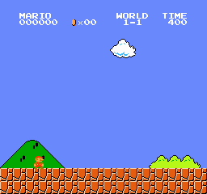
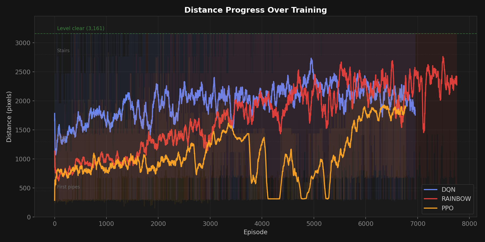
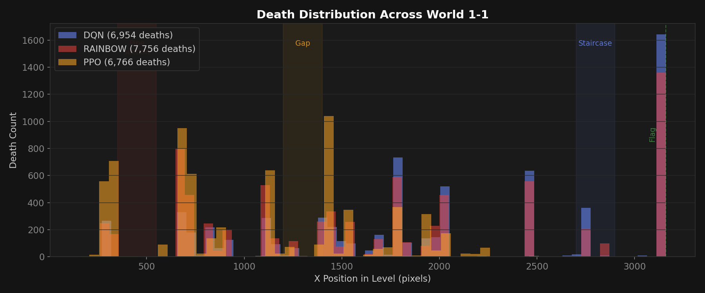
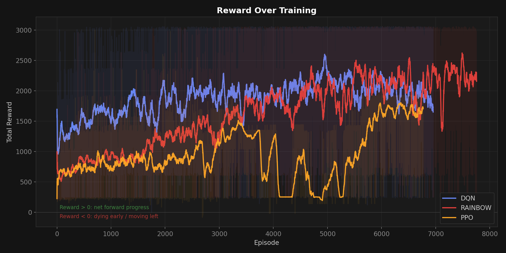
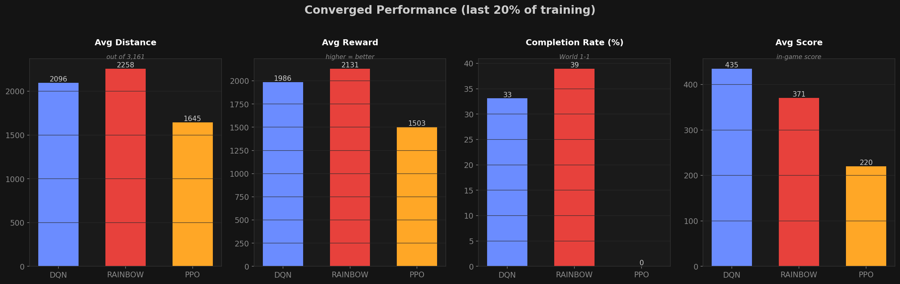
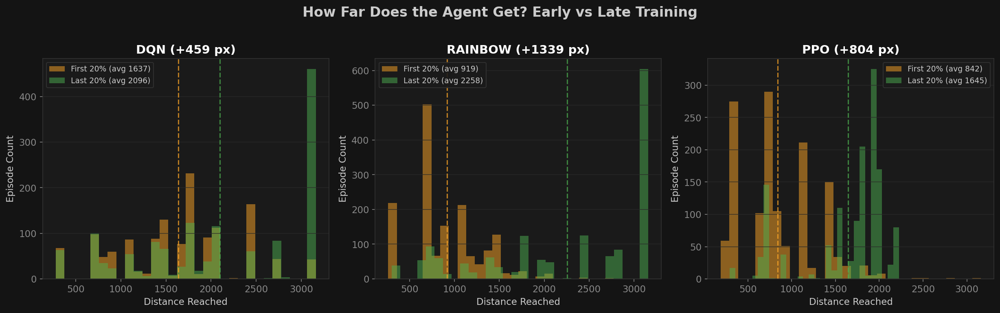
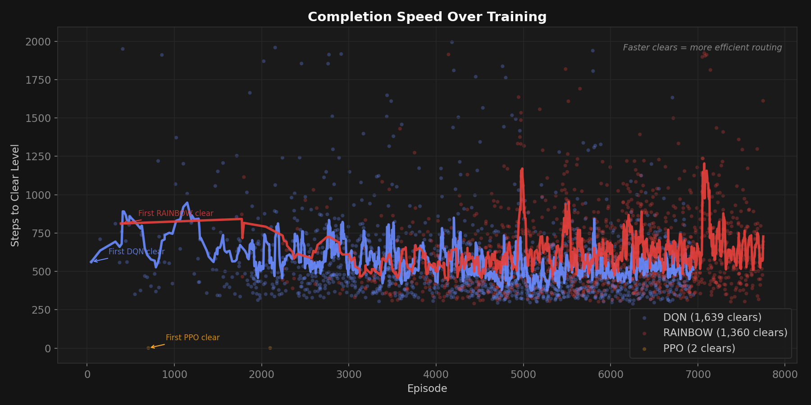

# Mario RL

Reinforcement learning agents trained to play Super Mario Bros (NES) entirely from raw pixels. No human demonstrations, no hand-crafted features, just a convolutional network, a reward signal, and 2 million training steps.



The agent above receives nothing but 84x84 grayscale frames as input. It has no concept of "pipe", "Goomba", or "gap"; those are just pixel patterns it learned to respond to. Jump timing, obstacle avoidance, enemy navigation are all emergent behavior from optimizing a single objective: move right, don't die.

This project compares three RL algorithms on the same task under the same compute budget to understand how algorithmic improvements translate to real performance differences.

---

## Results

Two value-based methods (DQN, Rainbow DQN) and one policy gradient method (PPO), each trained for 2M timesteps on World 1-1 using a GTX 1080. The reward signal is x-position delta: the agent receives positive reward for moving right and negative reward for standing still or moving left.

| | DQN | Rainbow DQN | PPO |
|---|---|---|---|
| **Completion rate** | 35% | **45%** | 0% |
| **Avg distance (px)** | 2,518 / 3,161 | **2,602** / 3,161 | 2,026 / 3,161 |
| **Training time** | ~16h | ~13h | ~5h |
| **Implementation** | Custom | Custom | Stable-Baselines3 |
| **Year introduced** | 2015 | 2017 | 2017 |

The best agent (Rainbow DQN) clears World 1-1 nearly half the time after 13 hours of training on consumer hardware. All completion rates evaluated over 20 episodes with deterministic (greedy) policies. Results will vary across runs due to random initialization and exploration.

The gap between DQN and Rainbow is worth examining. Both share the same CNN backbone, the same hyperparameters, and the same training budget. The only differences are how they sample from the replay buffer and how the final network layer is structured. That alone accounts for a 10 percentage point improvement in completion rate, which makes sense when you think about what's actually happening during training.

In vanilla DQN, the agent samples uniformly from its memory. Most of those memories are routine: walking right, collecting coins. The rare but critical transitions (barely missing a jump, dying to an enemy it hadn't seen at that position before) get the same sampling weight as everything else. Prioritized replay fixes this by replaying surprising transitions more often. The agent spends more time studying its mistakes.

The dueling architecture contributes differently. In many Mario states, most actions lead to the same outcome. If you're mid-air over a pit, it doesn't matter whether you press left or right. A standard Q-network has to learn this independently for every action. The dueling split lets the network say "this state is bad, period" through the value stream, freeing the advantage stream to focus on states where the action choice actually matters.

PPO tells a different story. It trained 3x faster in wall-clock time and looked competitive through the first 75% of training, reaching an average distance of 2,026 (64% of the level). But it never completed a single run. The agent consistently died at the same obstacle near the gap, suggesting it converged to a fixed policy that couldn't adapt past that section. On-policy methods need diverse rollout data to produce stable gradient estimates, and 4 parallel environments wasn't enough. With 64+ environments (the typical PPO setup), results would likely be very different, but that wasn't the point of this comparison. Same budget, different approaches, honest results.

### Gameplay

**Rainbow DQN** clears the level, navigates enemies and gaps confidently:


**DQN** also clears, but with slightly less consistent timing through the later sections:


**PPO** reaches the midpoint but dies at the gap consistently:


### Training Progress



One of the more interesting things to watch is how the agent improves. It's not a smooth curve. The agent will spend thousands of episodes dying at the same pipe, making no visible progress, then suddenly clear it and immediately start dying at the *next* obstacle. This staircase pattern is characteristic of environments where rewards are sparse and progress requires chaining multiple skills. You can't learn to clear the gap until you've first learned to reach it.

### Death Distribution



If you've played World 1-1, this chart should look familiar. The death clusters map directly to the sections that give human players trouble on their first attempts: the pipe section around x=450 where enemies patrol narrow corridors, the gap at x=1300 that requires a precise running jump, and the staircase approach near the flag where multiple enemies converge.

What's less obvious from a static chart is that this distribution shifts over training. Early on, deaths concentrate at x=200-400 (the agent can barely navigate the first obstacles). By late training, most deaths are past x=1500. The agent has solved the early game and is consistently reaching the harder later sections.

<details>
<summary><b>Additional metrics</b></summary>









</details>

---

## Approach

### How the Agent Sees the Game

A human sees Mario, pipes, coins, and enemies. The agent sees a tensor.

The raw game outputs 240x256 RGB frames at 60fps, far more information than a small CNN can process efficiently. Following the preprocessing pipeline established by [Mnih et al. 2015](https://www.nature.com/articles/nature14236), we reduce this to something tractable:

```
240x256 RGB @ 60fps  ->  4 x 84 x 84 float32
```

Each step in this pipeline has a specific purpose:

- **Frame skip (4)**: the agent acts every 4th frame, repeating its last action in between. Most consecutive frames are nearly identical (a Goomba moves maybe 2 pixels between frames). Reducing the decision frequency by 4x dramatically speeds up training with negligible control loss.

- **Grayscale + resize (84x84)**: color adds no useful gameplay information. A green pipe and a gray pipe are both obstacles. Combined with the resize, this gives a ~27x reduction in input size, which directly translates to faster training and less memory.

- **Frame stacking (4)**: this is the subtle one. A single frame is a photograph. There's no way to distinguish a Goomba moving left from one moving right, or to tell whether Mario is ascending or descending from a jump. Stacking 4 consecutive frames gives the network something closer to a short video clip, and from that it can infer velocity and direction. Without this, the agent can't time jumps properly.

### Algorithms

<details>
<summary><b>DQN (2015)</b></summary>

Custom implementation of Double DQN. The agent learns Q(s,a), an estimate of the total future reward from taking action *a* in state *s*. At each step, it picks the action with the highest Q-value.

The original DQN paper was significant because it was the first time a single architecture learned to play multiple Atari games at human level directly from pixels. Two ideas made it work:

**Experience replay** stores the last 100k transitions in a buffer and trains on random samples rather than sequential experience. This matters more than it sounds. Without it, the network sees thousands of nearly identical "walking right" frames in a row and the gradient updates become heavily biased toward whatever the agent happened to be doing recently. Random sampling breaks this correlation and stabilizes learning.

**Target network** is a frozen copy of the Q-network that provides the regression target, synced every 10k steps. Without it, every gradient update shifts the target, creating a feedback loop where the network chases its own predictions.

We use **Double DQN** ([Van Hasselt 2016](https://arxiv.org/abs/1509.06461)), which uses the online network to select the best action but the target network to evaluate it. Standard Q-learning has a well-documented tendency to overestimate action values because it uses the max operator for both selection and evaluation. It's biased toward actions that happen to look good on a small sample rather than actions that are genuinely good.

Network: 3 convolutional layers (32, 64, 64 filters with decreasing kernel size) followed by 2 fully connected layers (512 hidden units, 7 output actions). ~1.7M parameters. Trained with Huber loss and gradient clipping at 10.0.

</details>

<details>
<summary><b>Rainbow DQN (2017)</b></summary>

[Hessel et al. 2018](https://arxiv.org/abs/1710.02298) systematically evaluated six independent DQN improvements and showed that combining them outperforms any single one. Our implementation uses three of them: Double DQN, prioritized replay, and the dueling architecture.

**Prioritized Experience Replay** ([Schaul et al. 2016](https://arxiv.org/abs/1511.05952)): the insight is that not all transitions are equally informative. A transition where the agent predicted a Q-value of 50 but the actual return was 5 carries far more learning signal than one where the prediction was 50 and the return was 48. Prioritized replay samples transitions proportional to their TD error. The bigger the prediction mistake, the more frequently that transition gets replayed.

This introduces a sampling bias (some transitions are seen disproportionately often), which is corrected through importance sampling weights. Beta, the correction exponent, is annealed from 0.4 to 1.0 over training, allowing aggressive prioritization early (when fast learning matters most) and gradually correcting to uniform sampling (when stability matters more).

**Dueling Architecture** ([Wang et al. 2016](https://arxiv.org/abs/1511.06581)): instead of estimating Q(s,a) directly, the network splits into two streams after the convolutional layers. One stream estimates V(s), how good this state is regardless of action. The other estimates A(s,a), how much better each action is than average. They're recombined as Q(s,a) = V(s) + A(s,a) - mean(A).

The intuition: in many game states, the action doesn't matter much. If Mario is safely running across flat ground, pressing right, right+jump, or right+sprint all lead to similar outcomes. A standard Q-network needs to learn accurate values for all 7 actions in that state. The dueling architecture can assign a high V(s) and near-zero advantages, learning the same information with less data.

</details>

<details>
<summary><b>PPO (2017)</b></summary>

Stable-Baselines3 implementation. PPO ([Schulman et al. 2017](https://arxiv.org/abs/1707.06347)) takes a fundamentally different approach from DQN. Instead of learning the value of each action, it directly learns a probability distribution over actions (the policy) and optimizes it through gradient ascent.

The key mechanism is the clipped surrogate objective. Without clipping, a single batch of good experience can cause a massive policy update that overshoots and destroys everything the agent learned. PPO bounds the update magnitude by clipping the probability ratio between old and new policies, ensuring each step is conservative.

Configuration: CnnPolicy, 4 parallel environments via DummyVecEnv, 2048 steps per rollout, 10 update epochs per batch, clip range 0.2, GAE lambda 0.95, entropy coefficient 0.01, linear learning rate decay.

PPO is an on-policy algorithm. It can only learn from data collected under its current policy, so every update requires fresh rollouts, making data efficiency inherently lower than DQN's off-policy replay. The standard mitigation is massive parallelism (64-256 environments), which our single-GPU setup couldn't support at scale.

</details>

---

## Usage

**Prerequisites**: Python 3.10, [uv](https://docs.astral.sh/uv/), NVIDIA GPU recommended, C++ build tools (Windows)

```bash
git clone https://github.com/Sayed-Husain/mario-reinforcment-learning.git
cd mario-reinforcment-learning
uv sync
```

```bash
# Train
uv run python train.py --config configs/dqn.yaml
uv run python train.py --config configs/rainbow.yaml
uv run python train.py --config configs/ppo.yaml

# Watch trained agent
uv run python play.py --config configs/dqn.yaml --model checkpoints/dqn_final.pt

# Generate comparison charts from training logs
uv run python generate_report.py

# Record gameplay
uv run python record_video.py --config configs/dqn.yaml --model checkpoints/dqn_final.pt
```

## Project Structure

```
mario_rl/
  agents/
    base.py              # Abstract agent interface
    dqn.py               # DQN / Rainbow (custom implementation)
    ppo.py               # PPO (Stable-Baselines3 wrapper)
  networks/
    dqn_net.py           # CNN with optional dueling heads
  config.py              # YAML config loading
  env.py                 # Environment factory + gym/gymnasium adapter
  metrics.py             # Per-episode CSV logger
  wrappers.py            # Preprocessing pipeline
configs/                 # One YAML per experiment
train.py                 # Entry point
play.py                  # Inference + rendering
generate_report.py       # Metrics CSV -> charts
record_video.py          # Gameplay -> GIF/MP4
```

## What's Next

### Curriculum Learning

All three agents were trained directly on the full game, enemies and all. But this isn't how humans learn complex tasks. You learn to walk before you learn to dodge, and you learn level geometry before you worry about enemies.

Curriculum learning formalizes this intuition. The idea is to start training on a simplified version of the level (same pipes, same gaps, same platforms, but no enemies) and let the agent master the spatial navigation first. Once it can reliably clear the geometry, you transition to the full game. The network weights carry over, so all the platforming knowledge is retained. The agent just needs to integrate one new skill: enemy avoidance.

The `gym-super-mario-bros` environment supports this directly through version flags (v0 = standard, v2 = no enemies), and a `CurriculumScheduler` is already implemented to track completion rate and advance stages automatically.

The critical design decision is stage duration and transition timing. Transition too early and the agent hasn't learned the geometry. Transition too late and the agent overfits to the simplified version, with movement patterns so specialized to the enemy-free layout that they don't transfer well. The epsilon schedule also needs consideration: exploration should partially reset on stage transitions to allow the agent to discover new strategies for dealing with enemies it has never encountered.

### Full Rainbow

Our implementation uses 3 of the 6 Rainbow components. The remaining three (multi-step returns, noisy nets, and distributional RL) each showed meaningful independent gains in the original paper. Multi-step returns (n=3) would likely have the most impact here, since Mario's reward structure has inherent delay: the benefit of jumping over a pipe isn't realized until several frames later, but a 1-step TD target treats it as if the reward should be immediate.

### Reward Shaping

The current reward signal is purely based on x-position change. Move right for positive reward, stand still or move left for negative. This creates a sparse reward landscape where the agent can spend hundreds of episodes dying at the first pipe with no gradient signal pointing toward improvement. Distance-based milestone bonuses or curiosity-driven exploration rewards could significantly compress the early training phase where the agent has learned to move but hasn't yet learned to navigate.

## License

MIT
